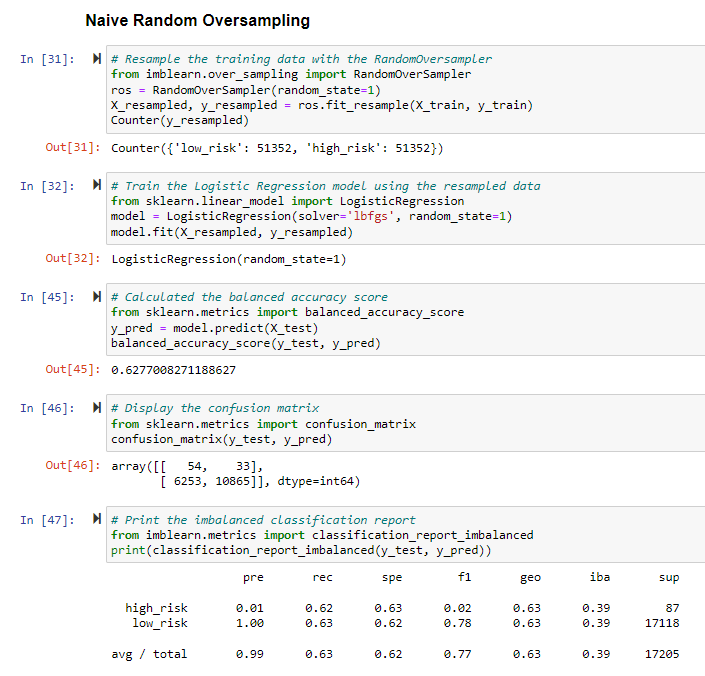
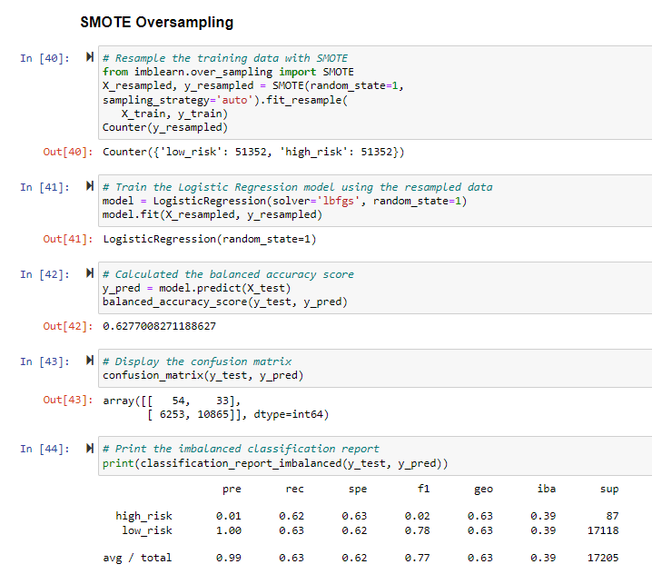
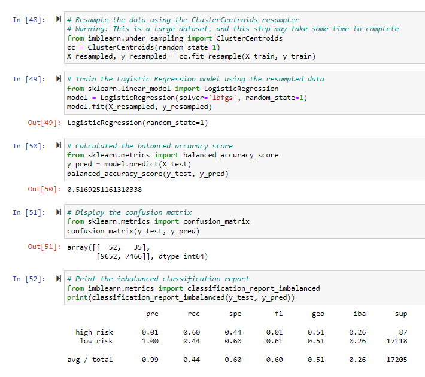
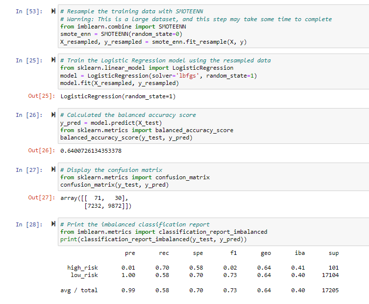
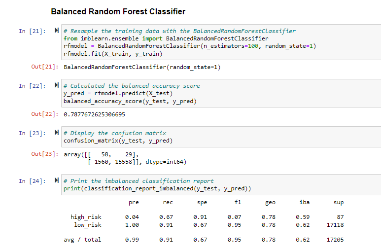
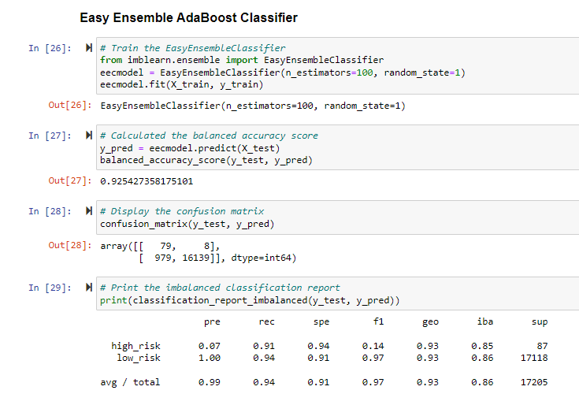

# Credit_Risk_Analysis

## Challenge Overview
### Overview of the Credit Risk Analysis
This analysis used the imbalanced-learn and scikit-learn libraries to build and evaluate models using a resampling method.  The first two models oversampled the data using the RandomOverSampler and SMOTE algorithms.  The third model undersampled the data using the ClusterCentroids algorithm.  The fourth model used a combination of over- and undersampling data using the SMOTEEN algorithm.  The final two models used were the BalancedRandomForestClassifier and EasyEnsembleClassifier machine learning models, which help to reduce bias.

## Resources
- LoanStats_2019Q1.csv

## Results

Naive Random Oversampling:
- The balanced accuracy score is 62.8%
- The precision for high risk is 1% with 62% recall and F score of 2%
- The precision for the low risk is almost 100%

SMOTE Oversampling:
- The balanced accuracy score is 62.8%
- The precision for high risk is 1% with 62% recall and F score of 2%
- The precision for the low risk is almost 100%

ClusterCentroids Undersampling:
- The balanced accuracy score is 51.7%
- The precision for high risk is 1% with 60% recall and F score of 1%
- The precision for the low risk is almost 100% with 44% recall

SMOTEEN (combination over/undersampling):
- The balanced accuracy score is 64.0%
- The precision for high risk is 1% with 70% recall and F score of 2%
- The precision for the low risk is almost 100% with 58% recall

Balanced Random Forest Classifier:
- The balanced accuracy score is 78.8%
- The precision for high risk is 4% with 67% recall and F score of 7%
- The precision for the low risk is almost 100% with 91% recall

Easy Ensemble AdaBoost Classifier:
- The balanced accuracy score is 92.5%
- The precision for high risk is 7% with 91% recall and F score of 14%
- The precision for the low risk is almost 100% with 94% recall

## Summary
Based on the above results of this analysis, the recommended model to use would be the Easy Ensemble classifier.  This model has the highest balanced accuracy score of the models at 92.5%.  It also has the highest precision for both high and low risk, as well as the highest associated recall values.
